#### [Documentación completa](https://www.notion.so/foddie-app-ca835afd161c479ab934b8717093e7d0)

## Express

He decido utilizar Express para montar el backend de mi aplicación, me gusta que sea ligero y minimalista que te permita crear la aplicación como a ti más te guste sin obligarte a seguir ciertas reglas, esto hace que puedas empezar el desarrollo de forma ágil y rápida, a la vez que permite escalarlo tanto como tú desees.

**Ventajas de Express:**

- Ligero
- Minimalista
- Transigente
- No te obliga a seguir una arquitectura en concreto
- Middleware muy potente y fácil de utilizar
- Buena documentación y gran comunidad
- Probablemente el framework para JavaScript más utilizado de lado servidor actualmente

**Desventajas de Express:**

- Si no tienes mucha experiencia puede ser complicado mantener una buena arquitectura
- Que no haya una forma concreta de hacer las cosas hace que al principio no tengas muy claro como organizar el código
- No te ofrece de base una gran cantidad de utilidades, esto depende de como lo veas puede ser también una ventaja

### Autenticación con JWT

**Login**

Cuando un usuario intenta hacer login, primero se busca un usuario en la colección de usuarios, si no existe, la constante incorrectCredentials valdrá directamente true y devuelve un error.

Si el usuario existe utilizo el método compare() de **bycript** para comparar la contraseña de la request que viene sin encriptar con la del usuario que está encriptada, si no son iguales incorrectCredentials evaluará true y devuelve el mismo error.

Por último firmamos el token con el método sign() de **jsonwebtoken** añadiendo el payload del usuario, la palabra secreta que se utilizará después para verificar el token y el tiempo de vida del token.

Devolvemos el usuario y el token.

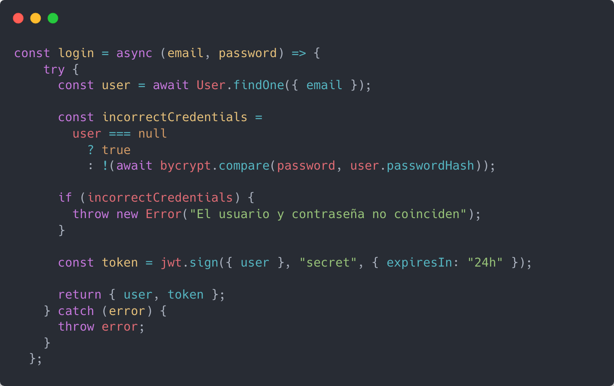

UserService.js

**requireAuth**

Es un middleware que es utilizado cuando se necesita que el usuario esté logeado para una ruta en específico, como en createOrder.

Primero recogemos de la request el header de authorization que debería contener el token.

Si la request no contiene esta cabecera o no es de tipo Bearer, devuelve un error.

Si lo contiene obtenemos el token suprimiendo la palabra Bearer para quedarnos únicamente con el token, y lo decodificamos utilizando el método verify() de **jsonwebtoken,** para verificarlo necesitamos la palabra secreta con la que ha sido firmado el token.

Si no hay token o no contiene el usuario, se devuelve un error.

Si el proceso ha salido bien se modifica la request añadiendo el user para utilizarlo posteriormente y se llama a la siguiente función del middleware.

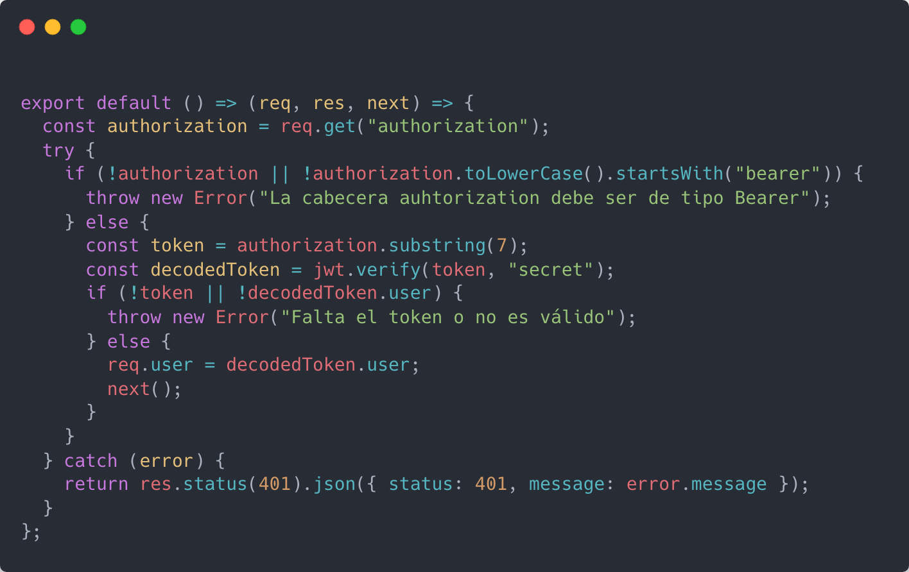

requireAuth.js

**requireAdmin**

Es un middleware que comprueba que el usuario de la request tenga el role admin, si el usuario es admin, se llama a la siguiente función, si no lo es devuelve un error de tipo unauthorized.

Para que primero se añada el usuario a la request, se llama a requireAuth, pasándole como parámetro next, una función callback que hace la comprobación del admin.

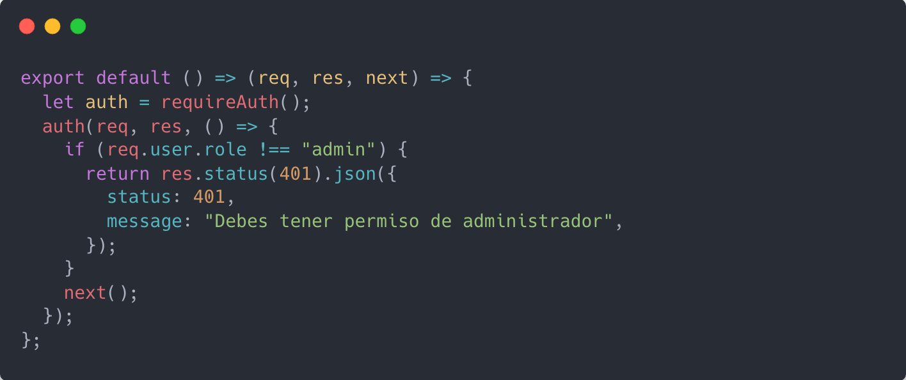

requireAdmin.js

## Estructura del proyecto

Ahora voy a explicar con capturas como he organizado el código para mantenerlo limpio y fácil de manipular.

- db
- middleware
- modules
- utils

Esta sería la estructura de carpetas dentro del proyecto, las voy a ir repasando una por una, pero primero veamos el `app.js` , que es donde arranca la aplicación.

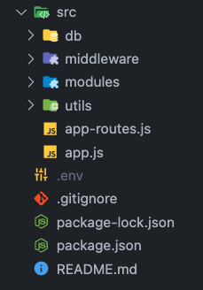

<aside>
ℹ️ En el `package.json` he indicado que el type es "module", esto trata a todos los archivos como módulos y permite utilizar las importaciones con las keywords import y export de ES6 en lugar de el require() de Node

</aside>

Lo he querido dejar lo más limpio posible dejando únicamente lo esencial, desde aquí creo la instancia de mi aplicación e inicio el servidor.

Utilizo método json() de express, esto sustituye lo que en versiones anteriores se hacía con el paquete **body-parser**. También habilito **cors** para poder recibir peticiones del cliente.

He creado otro archivo para registrar las rutas, a este le paso la instancia de la aplicación.

Finalmente abro el servidor en el puerto indicado en la variable de entorno, si no se proporciona, por defecto se abre en el 3000, una vez abierto el servidor inicio la conexión con mongo llamando al método connect() que exporto desde el archivo ubicado en la carpeta db.

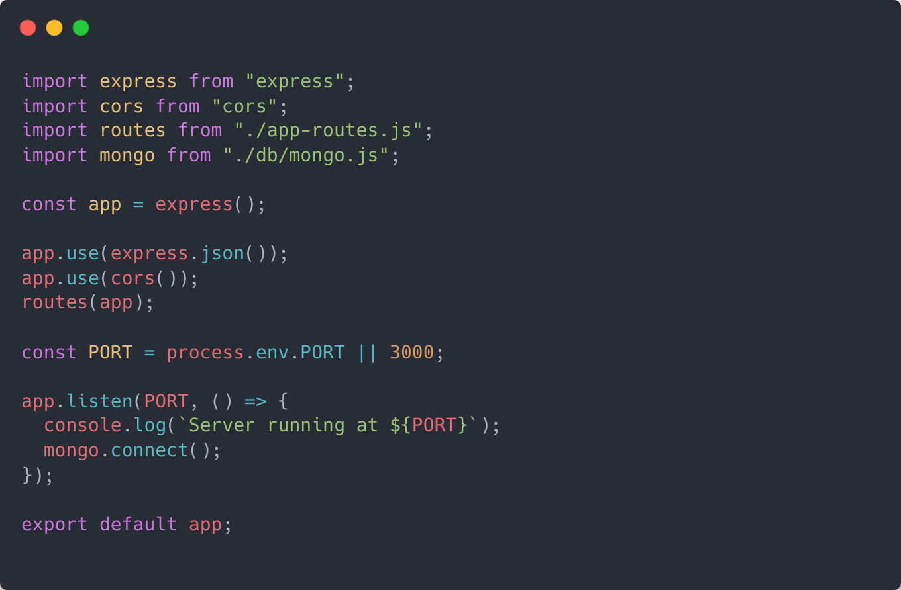

app.js

Este es el archivo de rutas, exporta una función que recibe la instancia de la aplicación y registra las rutas para cada módulo con su prefijo correspondiente.

He creado un middleware muy sencillo llamado requestLogger que hace un console.log de la ruta solicitada y un handler para devolver un mensaje en caso de 404

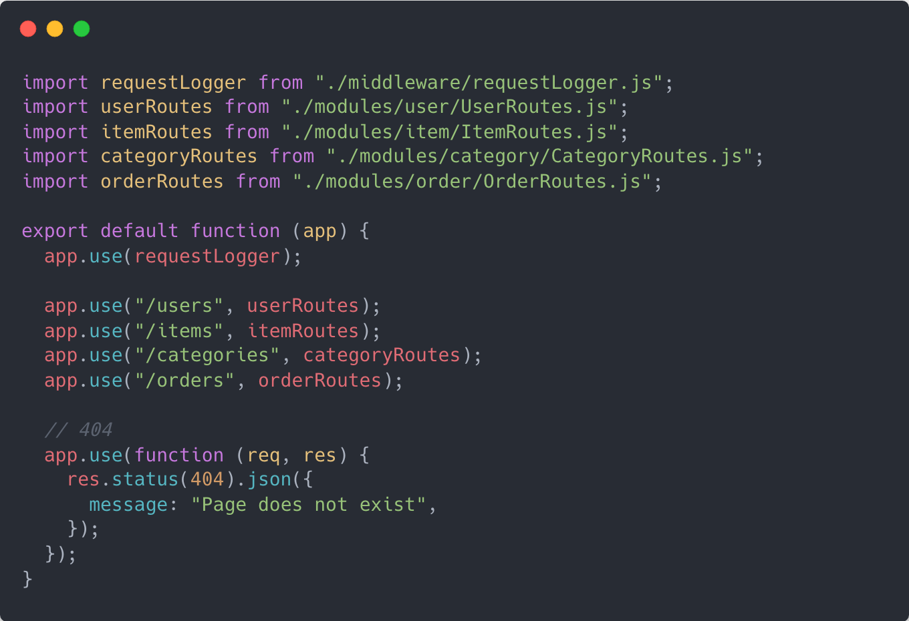

app-routes.js

Este archivo exporta un par de métodos, uno para iniciar la conexión con la base de datos y otro que la desconecta, de nuevo coge la URI de mongo desde una variable de entorno, en este caso debo importar **dotenv** para llamar al método config() y recoja todas las variables de entorno que se encuentran en el archivo `.env`

No estoy seguro por qué para el puerto no es necesario llamar a este método y funciona perfectamente, pero para este caso es estrictamente necesario para que funcione.

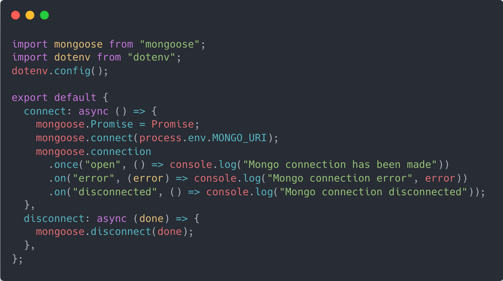

mongo.js

### Módulos

Cada módulo cuenta con:

- Rutas
- Controlador
- Servicio
- Modelo
- Comandos (validadores para la request)

Voy a explicar el recorrido que sigue un caso de uso en concreto desde las rutas hasta llegar al modelo, lo voy a hacer con Actualizar Item ya que es el ejemplo más completo.

**Rutas**

Defino la URL para cada ruta, añado los validadores si es necesario y mando la request para que la procese el controlador. El **:id** significa que se pasa como parámetro en la URL. Desde aquí podemos encadenar los middleware necesarios para la ruta

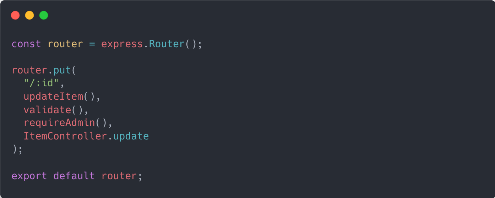

ItemRoutes.js (contenido reducido)

**Controlador**

He metido el controlador en un **IFEE** ya que me permite agrupar los métodos y devolver los que sean necesarios, manejando así la visibilidad de las propiedades del módulo.

Cada método recibe como parámetros req (que contiene toda la información de la request) y res (que permite devolver la response).

Se recoge el id de los params de la request y el body completo. Como la siguiente operación puede dar un error, está dentro de un **try/catch.**

Llamamos a el método correspondiente del servicio, si todo sale bien, se devuelve la response con el item actualizado y si sucede algún error se devuelve el mensaje del error

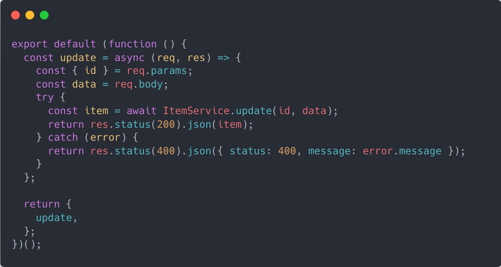

ItemController.js (contenido reducido)

**Servicio**

El servicio está dentro de un **IFEE** igual que el controlador. Este método ya recibe los parámetros id y data (el body).

Primero se comprueba si existe la categoría que queremos asignar al item, si no existe, devuelve un error que es recogido por el controlador.

Se actualiza el item, la. opción **new: true** es para que devuelva el item una vez actualizado, por defecto manda el item antes de ser actualizado, si no se encuentra el item devuelve un error.

Finalmente, si todo ha salido bien se devuelve el item modificado.

El método **populate()** recibe como parámetro el nombre de la propiedad que queremos rellenar, ya que en la colección item solo guardamos el id de la categoría, si los hemos relacionado previamente en el modelo, este método por debajo hace un getById a la colección categoría y así poder devolver la categoría completa (con su nombre en este caso).

Es similar al **join** de SQL, pero sin ser transaccional, esto quiere decir que en una aplicación muy grande con muchas peticiones por segundo, se puede dar el caso de devolver una categoría que ha sido eliminada y por lo tanto estaría devolviendo información falsa.

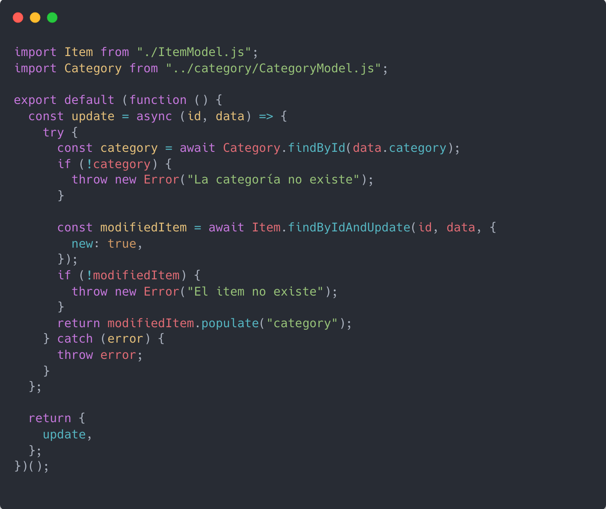

ItemService.js (contenido reducido)

**Modelo**

Para poder utilizar los métodos en el servicio debemos declarar el modelo con **mongoose**, opcionalmente podemos definir un schema para que solo se añadan las propiedades que nosotros indicamos. Las relaciones las creamos añadiendo **ref** y el nombre de la colección que queremos relacionar.

Mongoose es un ODM, como un ORM pero para bases de datos basadas en documentos. Nos permite hacer uso de métodos ya definidos en lugar de escribir nosotros las queries directamente.

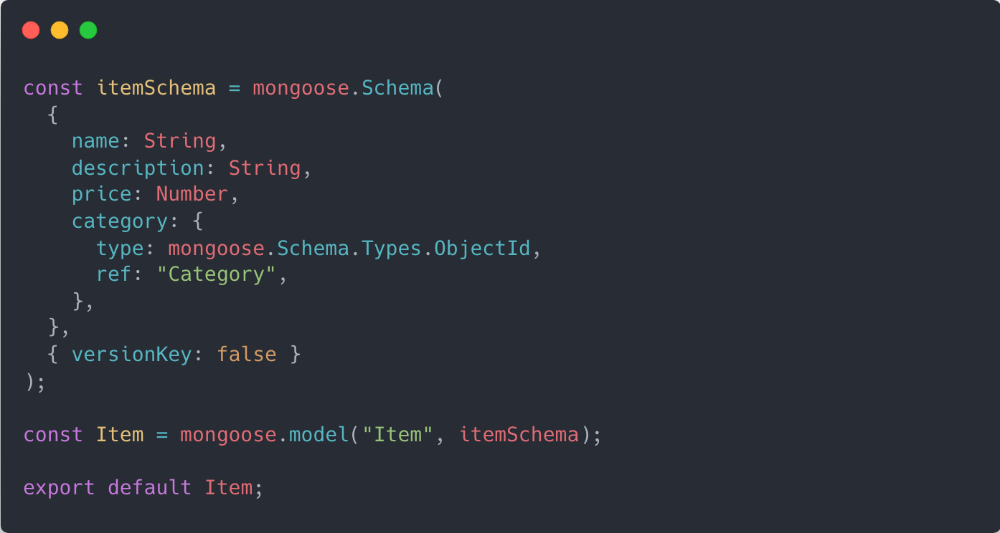

ItemModel.js

**Validadores**

He utilizado **express-validator** para validar las request, la sintaxis es muy parecida a Jest, funciona con una cadena de validación en la que podemos encadenar métodos, que pueden ser validators o sanitizers (para transformar la información), también podemos crear los nuestros propios.

El método param() sirve para recoger parámetros por URL

Comprueba que el parámetro Id es un ObjectId de mongo.

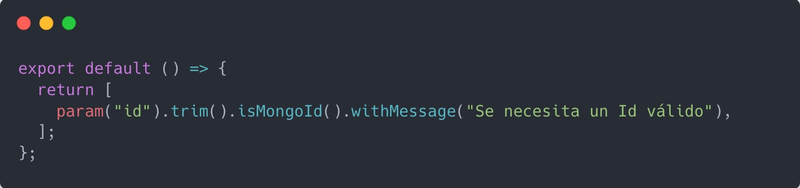

isMongoId.js

El método body() sirve para recoger parámetros del body

Comprueba que hay un parámetro name y que no está vacío, que su longitud es mayor a 3 y utilizo un custom sanitizer que pone mayúscula la primera letra de cada palabra. Entre otros.

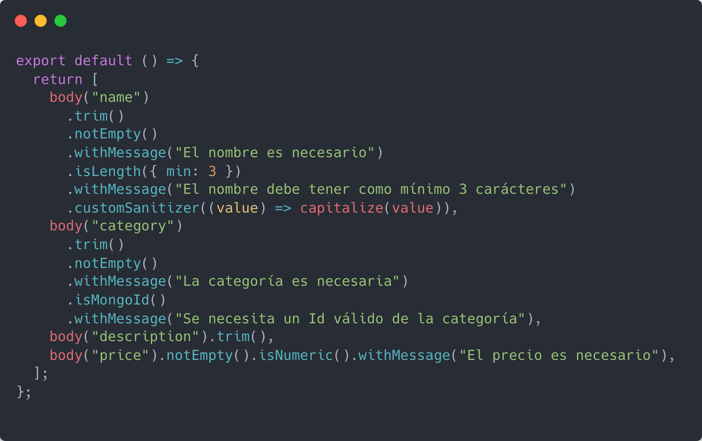

createItem.js

Ya que updateItem y createItem tienen el mismo contenido en el body lo he reutilizado aquí y añadido el isMongoId para que compruebe el Id que llega como parámetro, como los validadores devuelven un array se pueden combinar fácilmente con un spread operator.

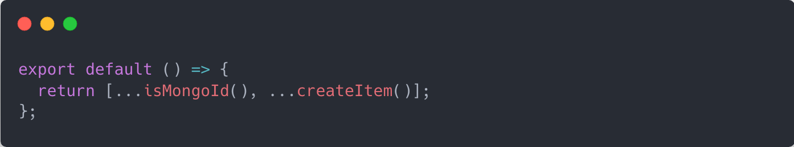

updateItem.js

Con el método validationResult() le pasamos la req y obtenemos los errores, seleccionamos el array y en mi caso solo quiero el primero y devolvemos el mensaje de error junto al parámetro que no ha pasado la validación. Si no hay errores simplemente le pasa la req al siguiente método.

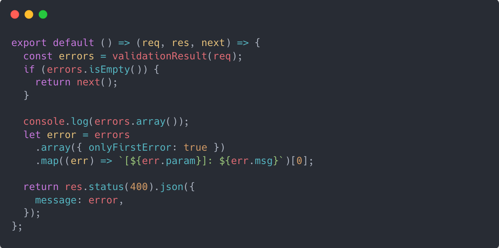

validate.js
